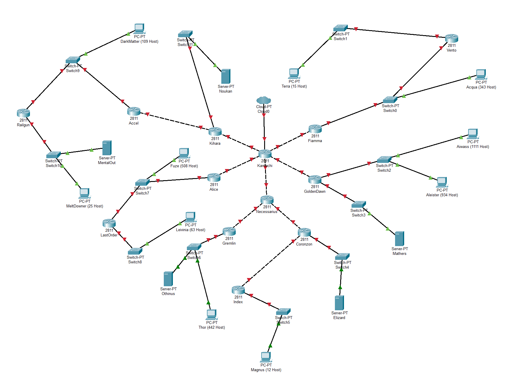
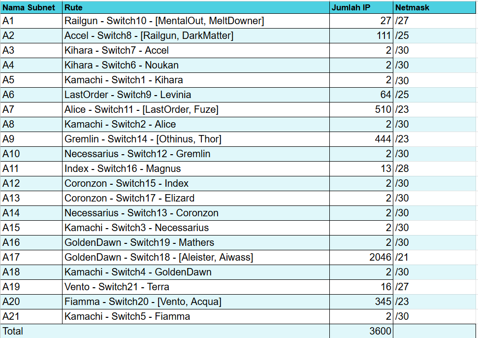
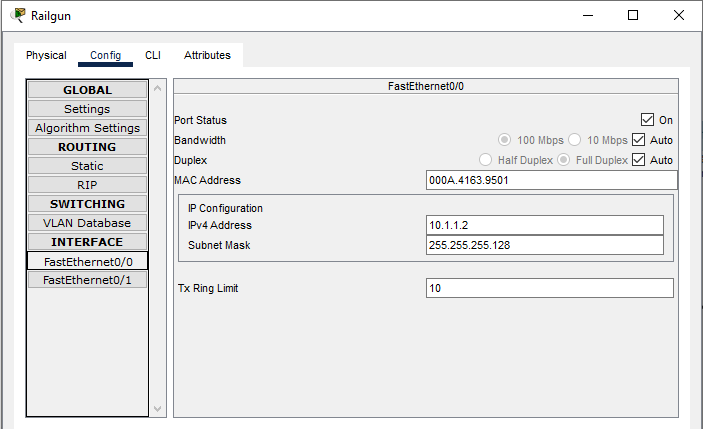
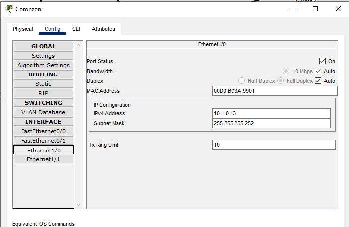
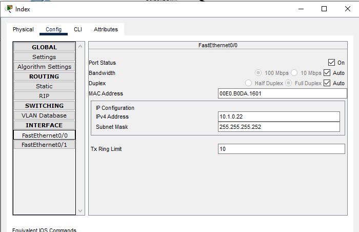
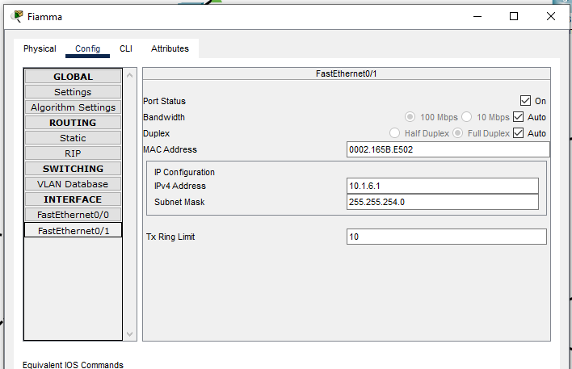
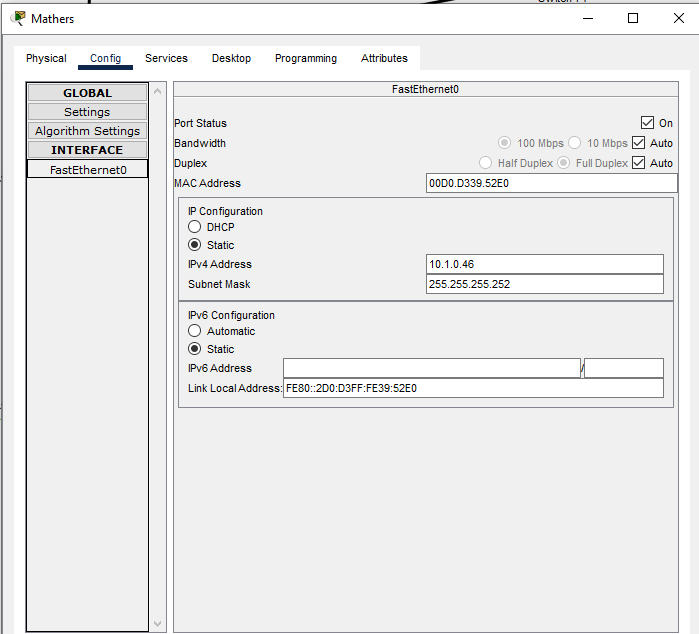
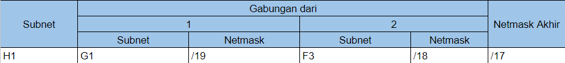

| Name           | NRP        | Class     |
| ---            | ---        | ----------|
| Alief Gilang Permana Putra | 5025221193 | Jaringan Komputer (B) |
| Mu'aafii Putra Ramadhan | 5025221135 | Jaringan Komputer (b) |

<br>

<b> Letakkan link excel hasil perhitungan di sini </b>
<br>
<b> _Place the excel calculation results link here_ </b>
```
https://docs.google.com/spreadsheets/d/1AHLtWkGZMwwj-771a-f7IB0sewkXr9M4O1W01INHxAk/edit?usp=sharing
```


# Laporan Praktikum Modul 4 Non Terraform

## Prefix IP
Letakkan prefix IP yang digunakan di bawah:

_Put IP prefix used below:_
```
10.1.x.x
```

## Topology

- GNS3
 
  

- CPT

  `

<br>

## Routing

- Routing table
  - CIDR
    
    

  - VLSM
    
    

- Route visualization in topology
  
  


<br>

## VLSM

### Tree

- Tree image

  

- IP distribution table

  

### Subnetting (If you use CPT)

#### Router
  ##### Kamachi
  
  
  
  
  

  ##### Kihara
  
  
  

  ##### Accel
  
  

  ##### Railgun
  
  

  ##### Alice
  
  
  
  

  ##### LastOrder
  
  

  ##### Necessarius
  
  
  
  

  ##### Gremlin
  
  

  ##### Coronzon
  
  
  
  

  ##### Index
  
  

  ##### GoldenDawn
  
  
  
  

  ##### Fiamma
  
  

  ##### Vento
  
  

#### Client
  ##### Acqua
  

  ##### Aiwass
  

  ##### Aleister
  

  ##### DarkMatter
  

  ##### Fuze
  

  ##### Leivinia
  

  ##### Meltdowner
  

  ##### Terra
  

  ##### Thor
  

#### Server
  ##### Elizard
  

  ##### Mathers
  

  ##### Noukan
  

  ##### Othinus
  

  ##### MentalOut
  

### Routing

Configuration to every router for routing.

- Kamachi:


- Fiamma:

  

- GoldenDawn:

  

- Necessarius:

 

- Alice:

  

- Kihara:

  

- Vento:


- Coronzon:

  

- Index:

  

- Gremlin:

  

- LastOrder:

  

- Accel:

 

- Railgun:

  

### Testing

- Client - client
  
  - beberapa client tes ke client lain
  
    
  

- Client - Server
  - DarkMatter(client) tes ke seluruh server

    

- Client - Router
  - Beberapa client tes ke router

    

- Server - Server
  - Tiap server tes ke server lain
  
    

- Server - Router
  - Semua server tes ke Kamachi (router)
  
    

- Router - Router
  - Router tes ke router lain

    

<br>

## CIDR

### Tree

- Tree image

  

- IP distribution table

  | Subnet  | Network ID  | Netmask             | Broadcast |
  | ------  | ----------  | -------             | --------- |
  | A1      | 10.1.0.128  | 255.255.255.224     | 10.1.0.159|
  | A2      | 10.1.0.0    | 255.255.255.128     | 10.1.0.127|
  | A3      | 10.1.1.0    | 255.255.255.252     | 10.1.1.3  |
  | A4      | 10.1.2.0    | 255.255.255.252     | 10.1.2.3  |
  | A5      | 10.1.4.0    | 255.255.255.252     | 10.1.4.3  |
  | A6      | 10.1.10.0   | 255.255.255.128     | 10.1.10.127|
  | A7      | 10.1.8.0    | 255.255.255.0       | 10.1.9.255|
  | A8      | 10.1.12.0   | 255.255.255.252     | 10.1.12.3 |
  | A9      | 10.1.16.0   | 255.255.254.0       | 10.1.17.255|
  | A10     | 10.1.18.0   | 255.255.255.252     | 10.1.18.3 |
  | A11     | 10.1.20.0   | 255.255.255.240     | 10.1.20.15|
  | A12     | 10.1.20.16  | 255.255.255.252     | 10.1.20.19|
  | A13     | 10.1.20.32  | 255.255.255.252     | 10.1.20.35|
  | A14     | 10.1.20.64  | 255.255.255.252     | 10.1.20.67|
  | A15     | 10.1.24.0   | 255.255.255.252     | 10.1.24.3 |
  | A16     | 10.1.40.0   | 255.255.255.252     | 10.1.40.3 |
  | A17     | 10.1.32.0   | 255.255.248.0       | 10.1.39.255|
  | A18     | 10.1.48.0   | 255.255.255.252     | 10.1.48.3 |
  | A19     | 10.1.66.0   | 255.255.255.224     | 10.1.66.31|
  | A20     | 10.1.64.0   | 255.255.254.0       | 10.1.65.255|
  | A21     | 10.1.68.0   | 255.255.255.252     | 10.1.68.3 |


### Subnet Merging Iteration

- Iteration 1

  

- Iteration 2

  

- Iteration 3

  

- Iteration 4

  

- Iteration 5

  

- Iteration 6

  

- Iteration 7

  


### Subnetting (GNS3)

Configuration to every router, client, and server for subnetting.

- Kamachi:

  ```
  auto eth0
  iface eth0 inet dhcp

  up iptables -t nat -A POSTROUTING -o eth0 -j MASQUERADE -s 10.1.0.0/16

  # Static config for eth1
  auto eth1
  iface eth1 inet static
    address 10.1.4.1
    netmask 255.255.255.252

  # Static config for eth2
  auto eth2
  iface eth2 inet static
    address 10.1.12.1
    netmask 255.255.255.252

  # Static config for eth3
  auto eth3
  iface eth3 inet static
    address 10.1.24.1
    netmask 255.255.255.252

  auto eth4
  iface eth4 inet static
    address 10.1.48.1
    netmask 255.255.255.252

  auto eth5
  iface eth5 inet static
    address 10.1.68.1
    netmask 255.255.255.252
  ```

- Fiamma:

  ```
  # Static config for eth0
  auto eth0
  iface eth0 inet static
    address 10.1.68.2
    netmask 255.255.255.252
    gateway 10.1.68.1

  # Static config for eth1
  auto eth1
  iface eth1 inet static
    address 10.1.64.1
    netmask 255.255.254.0
  ```

- GoldenDawn:

  ```
  # Static config for eth0
  auto eth0
  iface eth0 inet static
    address 10.1.48.2
    netmask 255.255.255.252
    gateway 10.1.48.1

  # Static config for eth1
  auto eth1
  iface eth1 inet static
    address 10.1.32.1
    netmask 255.255.248.0

  # Static config for eth2
  auto eth2
  iface eth2 inet static
    address 10.1.40.1
    netmask 255.255.255.252
  ```

- Necessarius:

  ```
  # Static config for eth0
  auto eth0
  iface eth0 inet static
    address 10.1.24.2
    netmask 255.255.255.252
    gateway 10.1.24.1

  # Static config for eth1
  auto eth1
  iface eth1 inet static
    address 10.1.18.1
    netmask 255.255.255.252

  # Static config for eth2
  auto eth2
  iface eth2 inet static
    address 10.1.20.65
    netmask 255.255.255.252
  ```

- Alice:

  ```
  # Static config for eth0
  auto eth0
  iface eth0 inet static
    address 10.1.12.2
    netmask 255.255.255.252
    gateway 10.1.12.1

  # Static config for eth1
  auto eth1
  iface eth1 inet static
    address 10.1.8.1
    netmask 255.255.254.0
  ```

- Kihara:

  ```
  auto eth0
  iface eth0 inet static
    address 10.1.4.2
    netmask 255.255.255.252
          gateway 10.1.4.1

  auto eth1
  iface eth1 inet static
    address 10.1.2.1
    netmask 255.255.255.252

  auto eth2
  iface eth2 inet static
    address 10.1.1.1
    netmask 255.255.255.252
  ```

- Vento:

  ```
  # Static config for eth0
  auto eth0
  iface eth0 inet static
    address 10.1.64.2
    netmask 255.255.254.0
    gateway 10.1.64.1

  # Static config for eth1
  auto eth1
  iface eth1 inet static
    address 10.1.66.1
    netmask 255.255.255.224
  ```

- Terra:

  ```
  # Static config for eth0
  auto eth0
  iface eth0 inet static
    address 10.1.66.2
    netmask 255.255.255.224
    gateway 10.1.66.1
  ```

- Acqua:

  ```
  # Static config for eth0
  auto eth0
  iface eth0 inet static
    address 10.1.64.3
    netmask 255.255.254.0
    gateway 10.1.64.1
  ```

- Aiwass:

  ```
  # Static config for eth0
  auto eth0
  iface eth0 inet static
    address 10.1.35.168
    netmask 255.255.248.0
    gateway 10.1.32.1
  ```

- Aleister:

  ```
  # Static config for eth0
  auto eth0
  iface eth0 inet static
    address 10.1.32.2
    netmask 255.255.248.0
    gateway 10.1.32.1
  ```

- Mathers:

  ```
  # Static config for eth0
  auto eth0
  iface eth0 inet static
    address 10.1.40.2
    netmask 255.255.255.252
    gateway 10.1.40.1
  ```

- Coronzon:

  ```
  # Static config for eth0
  auto eth0
  iface eth0 inet static
    address 10.1.20.66
    netmask 255.255.255.252
    gateway 10.1.20.65

  # Static config for eth1
  auto eth1
  iface eth1 inet static
    address 10.1.20.17
    netmask 255.255.255.252
    
  # Static config for eth2
  auto eth2
  iface eth2 inet static
    address 10.1.20.33
    netmask 255.255.255.252
  ```

- Elizard:

  ```
  # Static config for eth0
  auto eth0
  iface eth0 inet static
    address 10.1.20.34
    netmask 255.255.255.252
    gateway 10.1.20.33
  ```

- Index:

  ```
  # Static config for eth0
  auto eth0
  iface eth0 inet static
    address 10.1.20.18
    netmask 255.255.255.252
    gateway 10.1.20.17

  # Static config for eth1
  auto eth1
  iface eth1 inet static
    address 10.1.20.1
    netmask 255.255.255.240
  ```

- Magnus:

  ```
  # Static config for eth0
  auto eth0
  iface eth0 inet static
    address 10.1.20.2
    netmask 255.255.255.240
    gateway 10.1.20.1
  ```

- Gremlin:

  ```
  # Static config for eth0
  auto eth0
  iface eth0 inet static
    address 10.1.18.2
    netmask 255.255.255.252
    gateway 10.1.18.1

  # Static config for eth1
  auto eth1
  iface eth1 inet static
    address 10.1.16.1
    netmask 255.255.254.0

  ```

- Thor:

  ```
  # Static config for eth0
  auto eth0
  iface eth0 inet static
    address 10.1.16.3
    netmask 255.255.254.0
    gateway 10.1.16.1
  ```

- Othinus:

  ```
  # Static config for eth0
  auto eth0
  iface eth0 inet static
    address 10.1.16.2
    netmask 255.255.254.0
    gateway 10.1.16.1
  ```

- LastOrder:

  ```
  # Static config for eth0
  auto eth0
  iface eth0 inet static
    address 10.1.8.2
    netmask 255.255.254.0
    gateway 10.1.8.1

  # Static config for eth1
  auto eth1
  iface eth1 inet static
    address 10.1.10.1
    netmask 255.255.255.128
  ```

- Leivinia:

  ```
  # Static config for eth0
  auto eth0
  iface eth0 inet static
    address 10.1.10.2
    netmask 255.255.255.128
    gateway 10.1.10.1
  ```

- Fuze:

  ```
  auto eth0
  iface eth0 inet static
    address 10.1.8.3
    netmask 255.255.254.0
    gateway 10.1.8.1
  ```

- Accel:

  ```
  # Static config for eth0
  auto eth0
  iface eth0 inet static
    address 10.1.1.2
    netmask 255.255.255.252
    gateway 10.1.1.1

  # Static config for eth1
  auto eth1
  iface eth1 inet static
    address 10.1.0.1
    netmask 255.255.255.128
  ```

- Railgun:

  ```
  # Static config for eth0
  auto eth0
  iface eth0 inet static
    address 10.1.0.2
    netmask 255.255.255.128
    gateway 10.1.0.1

  # Static config for eth1
  auto eth1
  iface eth1 inet static
    address 10.1.0.129
    netmask 255.255.255.224
  ```

- MeltDowner:

  ```
  # Static config for eth0
  auto eth0
  iface eth0 inet static
    address 10.1.0.131
    netmask 255.255.255.224
    gateway 10.1.0.129
  ```

- MentalOut:

  ```
  # Static config for eth0
  auto eth0
  iface eth0 inet static
    address 10.1.0.130
    netmask 255.255.255.224
    gateway 10.1.0.129

  ```

- DarkMatter:

  ```
  # Static config for eth0
  auto eth0
  iface eth0 inet static
    address 10.1.0.3
    netmask 255.255.255.128
    gateway 10.1.0.1
  ```

- Noukan:

  ```
  auto eth0
  iface eth0 inet static
    address 10.1.2.2
    netmask 255.255.255.252
    gateway 10.1.2.1

  ```

### Routing

Configuration to every router for routing.

- Kamachi:

  ```
  route add -net 10.1.0.128 netmask 255.255.255.224 gw 10.1.4.2 # To Railgun A1
  route add -net 10.1.0.0 netmask 255.255.255.128 gw 10.1.4.2 # To Accel A2 
  route add -net 10.1.1.0 netmask 255.255.255.252 gw 10.1.4.2 # To Kihara A3
  route add -net 10.1.2.0 netmask 255.255.255.252 gw 10.1.4.2 # To Kihara A4

  route add -net 10.1.10.0 netmask 255.255.255.128 gw 10.1.12.2 # To LastOrder A6
  route add -net 10.1.8.0 netmask 255.255.254.0 gw 10.1.12.2 # To Alice A7

  route add -net 10.1.16.0 netmask 255.255.254.0 gw 10.1.24.2 # To Gremlin A9
  route add -net 10.1.18.0 netmask 255.255.255.252 gw 10.1.24.2 # To Coronzon A10
  route add -net 10.1.20.0 netmask 255.255.255.240 gw 10.1.24.2 # To Index A11
  route add -net 10.1.20.16 netmask 255.255.255.252 gw 10.1.24.2 # To Coronzon A12
  route add -net 10.1.20.32 netmask 255.255.255.252 gw 10.1.24.2 # To Coronzon A13
  route add -net 10.1.20.64 netmask 255.255.255.252 gw 10.1.24.2 # To Coronzon A14

  route add -net 10.1.40.0 netmask 255.255.255.252 gw 10.1.48.2 # To GoldenDawn A16
  route add -net 10.1.32.0 netmask 255.255.248.0 gw 10.1.48.2 # To GoldenDawn A17

  route add -net 10.1.66.0 netmask 255.255.255.224 gw 10.1.68.2 # To Vento A19
  route add -net 10.1.64.0 netmask 255.255.254.0 gw 10.1.68.2 # To Fiamma A20
  ```

- Fiamma:

  ```
  route add -net 10.1.66.0 netmask 255.255.255.224 gw 10.1.64.2 # To Vento A19
  ```

- GoldenDawn:

  ```
  no necessary routing config in gns3
  ```

- Necessarius:

  ```
  route add -net 10.1.16.0 netmask 255.255.254.0 gw 10.1.18.2 # To Gremlin A9
  route add -net 10.1.20.0 netmask 255.255.255.240 gw 10.1.20.66 # To Index A11
  route add -net 10.1.20.16 netmask 255.255.255.252 gw 10.1.20.66 # To Coronzon A12
  route add -net 10.1.20.32 netmask 255.255.255.252 gw 10.1.20.66 # To Coronzon A13
  ```

- Alice:

  ```
  route add -net 10.1.10.0 netmask 255.255.255.128 gw 10.1.8.2 # To LastOrder A6
  ```

- Kihara:

  ```
  route add -net 10.1.0.128 netmask 255.255.255.224 gw 10.1.1.2 # To Railgun A1
  route add -net 10.1.0.0 netmask 255.255.255.128 gw 10.1.1.2 # To Accel A2 
  ```

- Vento:

  ```
  No necesary routing config in gns3
  ```

- Coronzon:

  ```
  route add -net 10.1.20.0 netmask 255.255.255.240 gw 10.1.20.18 # To Index A11
  ```

- Index:

  ```
  No necesary routing config in gns3
  ```

- Gremlin:

  ```
  No necesary routing config in gns3
  ```

- LastOrder:

  ```
  No necesary routing config in gns3
  ```

- Accel:

  ```
  route add -net 10.1.0.128 netmask 255.255.255.224 gw 10.1.0.2 # To Railgun
  ```

- Railgun:

  ```
  No necesary routing config in gns3
  ```

### Testing

- Client - client
  
  - Aiwass (10.1.35.168) to MeltDowner (10.1.0.130)
  
    
  

- Client - Server
  - Magnus (10.1.20.2) to Elizard (10.1.20.34)

    

- Client - Router
  - Terra (10.1.66.2) to Kamachi (10.1.68.1)

    

- Server - Server
  - Mathers (10.1.40.2) to Noukan (10.1.2.2)
  
    

- Server - Router
  - Othinus (10.1.16.2) to Railgun (10.1.0.2)
  
    

- Router - Router
  - Accel (10.1.1.2) to Index (10.1.20.18)

    

<br>
  
## Problems
1. Pada GNS3, terdapat bug tidak menentu dimana suatu host tidak dapat melakukan ping menuju host lain baik pada subnet berbeda maupun pada subnet yang sama padahal semua konfigurasi routing sudah benar serta sebelumnya dapat terhubung dengan ping. Cara mengatasi hal ini sementara adalah melakukan restart semua node pada topologi, apabila cara ini tetap gagal maka restart GNS3 beserta VM
<br>

2. Pada CPT, terkadang perlu di tes berkali-kali dulu baru bisa mendapatkan hasil 'succesful'

## Revisions (if any)
1. Pelengkapan Routing pada VLSM menggunakan Cisco Packet Tracer <br>
2. Pembenaran pengetasan routing VLSM pada cisco Packet Tracer